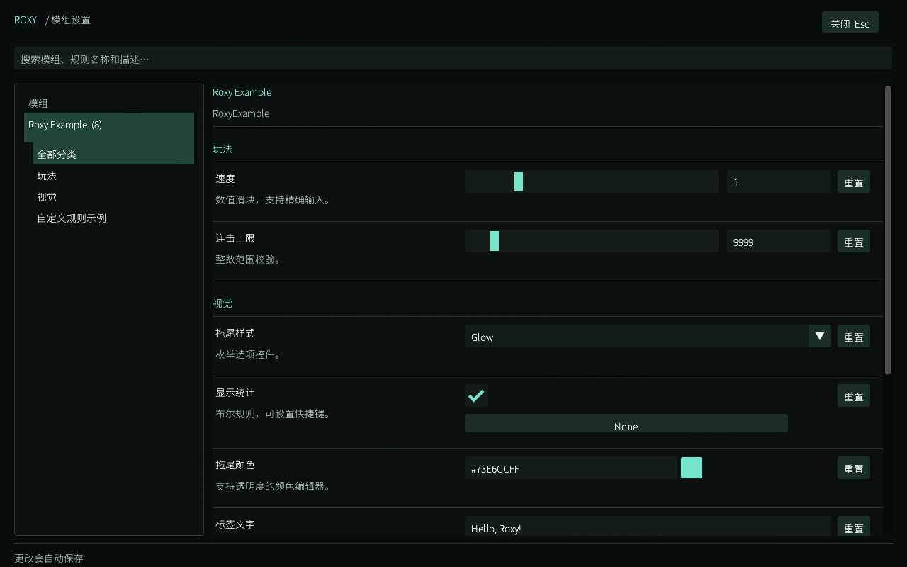

# RoxyLib for ADOFAI

面向 Unity Mod Manager 的规则与设置库。规则类型、持久化、快捷键与 GUI 各自独立；业务 mod 可以注册自己的值类型、声明通用编辑控件，或提供 ImGui 绘制回调。

本次重构不兼容旧 API 和旧配置。旧 Overlay 功能已移除。设计记录见 [重构说明](docs/refactor-audit.md)，依赖和恢复方法见 [依赖说明](docs/dependency-plan.md)。

## 设置页

全屏深色设置页参考 [CheryTools](https://github.com/adofaiex/CheryTools) 的视觉风格，采用 ImGui.NET。支持按 mod / 分类浏览、搜索、数值滑块与精确输入、布尔值及快捷键、枚举、颜色、文字和恢复默认值。



上图来自真实 ImGui 绘制数据的软件预览，尚非游戏截图；另有 [较小尺寸预览](docs/previews/settings-compact.png)。

从 UMM 的 RoxyLib 面板点击“打开设置”。所有规则初始均不绑定快捷键。设置页打开状态只在本次运行有效，打开设置的快捷键可保存。

文字在回车、失去编辑焦点、切换分类或关闭页面时提交。无效输入保留并显示错误，需修正或重置后再关闭。规则改动防抖保存，保存失败会保留待保存状态并显示重试按钮。

## 接入 mod

业务项目引用 RoxyLib，UMM 的 Info.json 中声明 `"Requirements": ["RoxyLib"]`。在 Setup 中先注册扩展类型和原有回调，再调用：

```csharp
public static void Setup(UnityModManager.ModEntry mod_entry) {
	RoxyLib.RoxyLib.Register(mod_entry);
}
```

Register 安装 UMM 生命周期回调，不立即扫描字段。启用时先扫描当前 mod 的规则、恢复默认值并载入配置，再调用业务 mod 原有 OnToggle(true)。扫描或启用失败会清理该次注册。重复 Register 同一个 ModEntry 不会重复订阅。

原有 OnToggle、OnSaveGUI 会保留。请在 Register 之前设置它们，之后不要重新覆盖这两个委托。禁用前会尝试保存；保存失败时拒绝禁用，避免静默丢失修改。有活动的依赖 mod 时需先禁用它们，再禁用 RoxyLib。

```csharp
using RoxyLib.Attribute;

[RoxyMod(ModId = "MyMod")]
public static class MyRules {
	[RoxyRule(Category = "Gameplay", Min = 0.5f, Max = 3f)]
	public static float Speed = 1f;

	[RoxyRule(Category = "General")]
	public static bool Enabled = true;

	[RoxyRule(Category = "General", Persistent = false)]
	public static bool SessionFlag;
}
```

字段必须 public static、可写且非 null。数值要求 Min < Max，默认值必须在范围内。重复 ModId / 分类 / 名称会拒绝注册；分类和名称不能包含点号。

读取字段可直接用于业务逻辑。修改请使用规则实例，让校验、通知和自动保存一起生效：

```csharp
RuleInfo rule = RuleManager.Find("MyMod", "Gameplay.Speed")!;
if (!rule.TrySetValue(1.5f, out string? error)) {
	// 显示或记录 error。
}
rule.ValueChanged += changed => {
	float speed = changed.GetValue<float>();
	// 应用新值。
};
```

TrySetValue 要求精确的 CLR 类型；TrySetText 使用类型注册的解析器。赋相同值不通知；配置初始加载不发送 ValueChanged。业务 OnToggle(true) 中能读取已加载的值。重新启用后的“重置”仍使用首次声明的默认值。

## 注册规则类型

RuleType<T> 负责稳定类型 ID、序列化、解析和校验，不依赖 GUI：

```csharp
RuleTypeRegistry.Register(new RuleType<RangeValue>(
	"my-mod/range",
	value => value.Minimum.ToString("R", CultureInfo.InvariantCulture)
		+ ";" + value.Maximum.ToString("R", CultureInfo.InvariantCulture),
	ParseRange,
	value => value.Minimum >= 0 && value.Maximum <= 100 && value.Minimum <= value.Maximum
		? null : "要求 0 <= 最小值 <= 最大值 <= 100。"));

private static bool ParseRange(string text, out RangeValue value) {
	value = default;
	string[] parts = text.Split(';');
	if (parts.Length != 2
		|| !double.TryParse(parts[0], NumberStyles.Float, CultureInfo.InvariantCulture, out double minimum)
		|| !double.TryParse(parts[1], NumberStyles.Float, CultureInfo.InvariantCulture, out double maximum))
		return false;
	value = new RangeValue(minimum, maximum);
	return true;
}
```

RangeValue 的定义及完整接入见 [CustomRuleTypes.cs](RoxyExample/CustomRuleTypes.cs)。序列化应使用固定文化格式并能往返解析；复杂值推荐不可变 struct 或不可变对象，编辑时返回新值。

默认按精确 CLR 类型推断，所以已注册的 RangeValue 字段直接使用 [RoxyRule] 即可。一个 CLR 类型需要多种表示时，以 `infer_for_fields: false` 注册额外类型，再用 `[RoxyRule(TypeId = "my-mod/alternative")]` 明确选择。

未注册类型会报错，不再自动当作字符串。重复类型 ID 或重复推断注册会报错。注册返回 IDisposable，释放会注销类型；请先移除使用该类型的规则，再释放对应类型与编辑器注册。示例保留注册至进程退出，可反复启用/禁用 mod。

内置支持 bool、string、所有常见整数、float、double、decimal、枚举、UnityEngine.Color。整数和 decimal 精确存储；浮点使用固定文化与往返格式，不接受 NaN/Infinity；颜色为 #RRGGBBAA（8 位通道）。数值滑块适合粗调，输入框保留完整精度。

## 扩展 GUI：两种方式

同一类型 ID 选择一种编辑器，重复注册会报错。两种方式都写回 RuleInfo，统一经过类型校验。

**声明通用控件**：支持 Text、Number、Toggle、OptionsList；可组合多个字段。读函数取出组件值，写函数返回完整新值。

```csharp
RuleEditorRegistry.RegisterSchema("my-mod/range", new RuleEditorSchema(
	EditorField.Number<RangeValue, double>(
		"Minimum", value => value.Minimum,
		(value, next) => new RangeValue(next, value.Maximum), 0, 100),
	EditorField.Number<RangeValue, double>(
		"Maximum", value => value.Maximum,
		(value, next) => new RangeValue(value.Minimum, next), 0, 100)));
```

**自定义 ImGui 绘制器**：用于通用控件难以表达的编辑方式。

```csharp
RuleEditorRegistry.RegisterCustom("example/percentage", context => {
	float value = (float)context.GetValue<Percentage>().Value;
	ImGui.SetNextItemWidth(-1);
	if (ImGui.SliderFloat("##value", ref value, 0, 1))
		context.SetValue(new Percentage(value));
});
```

回调在 RoxyLib 的 ImGui context 和独立规则 ID 作用域中执行。Begin/End、Push/Pop 必须配对；不要切换 context 或开始/结束 frame。当前渲染后端提供标准控件、文字和几何图形，尚未提供外部纹理注册及原生 draw callback 支持。缺少编辑器的类型以只读值显示。

RoxyExample 同时演示了双数值通用编辑器和自定义进度编辑器，二者均通过字段注册使用。

## 运行时注册

mod 已启用后可添加、移除规则：

```csharp
RuleInfo runtime = RuleManager.Register(new RuleInfo(
	"MyMod", "Enabled", "Dynamic",
	RuleTypeRegistry.Resolve(typeof(bool)), false));
RuleManager.Remove(runtime);
```

动态注册立即接入已保存配置、快捷键、自动保存和 GUI。移除时记住当前值；同一会话重新注册相同标识可取回值。Registered 通知在配置载入后发出；注册回调抛异常会回滚这条规则，Removed 回调异常会被记录并继续清理。所有注册、修改和 GUI API 均在 Unity 主线程调用。

## 快捷键与输入

- 仅 bool 规则支持快捷键，初始值为 None。
- 支持 Ctrl / Shift / Alt 与一个主键；左右修饰键等价，额外修饰键不会误匹配。
- 相同组合同时切换所有对应规则；按住不重复触发。
- GUI 打开或捕获期间暂停规则快捷键；释放后重新按下才响应。
- Esc 在捕获时取消捕获，否则关闭设置页。
- 打开设置页会屏蔽 Unity EventSystem、UMM 的 OnGUI，以及当前游戏的 RDInput 托管输入入口；关闭后再保留一帧输入屏蔽。
- 其他 mod 若绕过这些入口、直接轮询 Unity Input，需要自行检查 `RoxyLib.RoxyLib.IsInputBlocked`。不要把这一机制视为对任意第三方输入代码的全局拦截。

ImGui 使用独立 context，不写 imgui.ini / imgui_log.txt。打开/关闭时管理鼠标可见性、锁定状态和 Unity IME；原生库版本不匹配会拒绝初始化。

## 配置与本地化

每个 mod 自己的目录存放 config.json：

```json
{
	"Version": 1,
	"ModId": "MyMod",
	"Rules": { "Gameplay.Speed": "1.5" },
	"Keybinds": { "General.Enabled": "Ctrl+K" }
}
```

按 mod 独立防抖，最后一次变更 0.5 秒后保存，失败重试间隔至少 1 秒。写入前先完成序列化，再以临时文件替换；失败保留原配置和待保存状态。尚未注册的配置项会保留，供之后注册的规则使用。

Persistent=false 只禁止值持久化，不影响 bool 快捷键保存。读取时一条无效值不阻断其他条目。损坏、旧版本或 ModId 不匹配的整个配置不会被覆盖：将原文件移到备份位置后，可以在设置页点击重试保存本次有效设置。旧配置不自动迁移。

语言文件为 mod 目录的 lang/en-us.json、zh-cn.json、ja-jp.json、ko-kr.json。只加载本 mod ID 前缀的条目，回退顺序：当前语言 → 英文 → 调用方提供的文本。

| 内容 | 键 |
| --- | --- |
| 规则名 / 描述 | MyMod.Gameplay.Speed / MyMod.Gameplay.Speed.Desc |
| 分类 | MyMod.Category.Gameplay |
| 通用编辑器标签 | MyMod.Extensions.Range.Editor.Minimum |

当前提供中英文界面。其他语言缺失时回退英文；字体主要覆盖拉丁文字、简体中文及其包含的日文字符，未另行加入韩文字体。

## 构建、验证与部署

目标为 Windows x64、net481。使用现有 .NET SDK / Framework 引用程序集和游戏 Managed 目录，游戏路径在 Directory.Build.props。新增依赖均为固定版本并有 packages.lock.json；具体清单见 [依赖说明](docs/dependency-plan.md)。

在项目目录运行：

```powershell
./scripts/Build.ps1 -Restore -Test
./scripts/Build.ps1 -Format -VerifyStyle -Test
```

Restore 仅使用项目 .packages；没有 Restore 时离线构建。脚本把 CLI、下载缓存和临时文件限制在项目中，并在退出时恢复进程环境变量。测试不用额外测试框架，写入 RoxyLib.Tests/obj/test-data，生成实际 ImGui 绘制数据的软件预览。它验证规则、配置、生命周期、快捷键、编辑提交和原生 GUI，但不代替 Unity 内的验收。

RoxyLib/bin/Debug/net481 中的 RoxyLib.dll、ImGui.NET.dll、三个 System 依赖、cimgui.dll、Info.json、lang、Resources 必须一起分发。业务 mod 保持对已安装 RoxyLib 的引用。仓库现有 Run.bat 会写入游戏 Mods 目录；构建与测试脚本不调用它。

游戏内需再验收全屏缩放、底层输入隔离、鼠标恢复、中文输入法、与其他 mod 共存及退出/重启后的保存。本次重构未自动部署或启动游戏。

## 许可

项目使用 MIT License。新增依赖的许可证随 RoxyLib/Resources/Licenses 分发，字体许可证见 Resources/Fonts/OFL.txt。CheryTools 仅作视觉和交互参考，本次未复制其实现代码。
